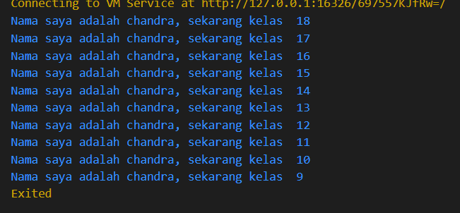

Nama : Chandra Bagus Sulaksono
Kelas : SIB-3D
no : 10

1. Soal 1
Modifikasilah kode pada baris 3 di VS Code atau Editor Code favorit Anda berikut ini agar mendapatkan keluaran (output) sesuai yang diminta!
Jawab:

2. Mengapa sangat penting untuk memahami bahasa pemrograman Dart sebelum kita menggunakan framework Flutter ? Jelaskan!
Jawab:
pemrograman Dart penting sebelum menggunakan Flutter karena Dart adalah dasar dari Flutter. Dengan pemahaman Dart,dapat menulis kode yang efisien, memahami struktur dan konsep widget dalam Flutter, serta memanfaatkan fitur-fitur unik Dart untuk membangun aplikasi yang optimal. Selain itu, pemahaman ini juga memudahkan debugging dan pengoptimalan performa aplikasi.

3. Rangkumlah materi dari codelab ini menjadi poin-poin penting yang dapat Anda gunakan untuk membantu proses pengembangan aplikasi mobile menggunakan framework Flutter.
jawab:

- Pengenalan Dart:
Dart adalah bahasa pemrograman yang digunakan untuk mengembangkan aplikasi dengan Flutter. Dart bersifat object-oriented dan memiliki sintaks yang sederhana dan mudah dipahami.

- Variabel dan Tipe Data:
Dart mendukung berbagai tipe data seperti int, double, String, bool, dan List. Deklarasi variabel dapat menggunakan var untuk tipe yang ditentukan secara otomatis, atau menyebutkan tipe secara eksplisit.

- Penggunaan Fungsi:
Fungsi dalam Dart didefinisikan menggunakan kata kunci void atau tipe data yang dikembalikan. Dart juga mendukung fungsi anonim (lambdas) dan fitur arrow syntax untuk fungsi yang singkat.

- Kontrol Alur:
Struktur kontrol seperti if-else, switch-case, for, while, dan do-while digunakan untuk mengatur alur eksekusi program. Dart juga memiliki fitur assert untuk debugging.

- Collections:
Dart menyediakan List, Set, dan Map sebagai jenis koleksi dasar. List digunakan untuk daftar berurutan, Set untuk kumpulan unik, dan Map untuk pasangan key-value.

- Null Safety:
Dart mendukung null safety, yang memungkinkan penanganan null lebih aman dan mengurangi risiko kesalahan runtime yang diakibatkan oleh null.

- Penggunaan Libraries:
Dart memiliki banyak library built-in yang memudahkan berbagai tugas seperti manipulasi string, operasi matematika, dan manajemen koleksi. Library eksternal juga dapat diimpor untuk memperluas fungsionalitas.

- Pemrograman Asinkron:
Dart mendukung async programming dengan Future, async, dan await, memungkinkan eksekusi kode secara non-blok untuk tugas-tugas seperti I/O.

- Konsep Object-Oriented:
Dart adalah bahasa yang berorientasi objek, mendukung kelas, pewarisan, abstraksi, dan enkapsulasi, yang penting untuk pengembangan aplikasi yang modular dan terstruktur.

# mobile